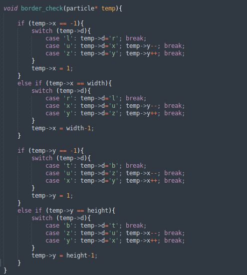
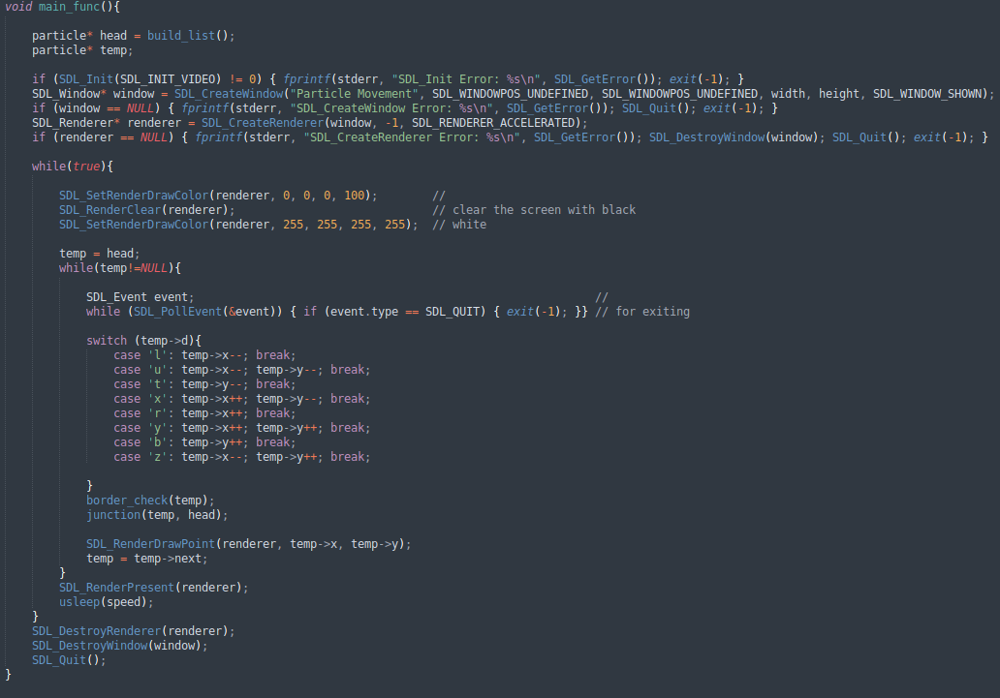

# Movement of Particles


### My goal in this project is to create a software that displays the movement of particles in specific 2D area, I wrote the whole code in C and I used SDL2 as a gui.


# Table of contents

* [Data Type](#Data-Type)
* [Build Function](#Build-Function)
* [Border Check](#Border-Check)
* [Junction Function](#Junction-Function)
* [Main Function](#Main-Function)
* [Parameters](#Parameters)
* [Results](#Results)


---

# Data Type
<a href="Bubble sort"></a>

This is the structure that i use for every particle, it consist of the x-axis and y-axis both as integrals, and of d the direction of the particle it's a character on of these: 'l', 'u', 't', 'x', 'r', 'y', 'b', 'z'. 

----
# Build Function

<a href="Bubble sort"></a>


In this function we try to build our linked list and give every x-axis and y-axis a random number, and give variable d a random character, 
To produce random nimbers i used the function rand() included in the header <stdlib.h>.

----

# Border Check

<a href="Bubble sort"></a>

Border Check checks if any particle has reached the borders, and if so it redirect it to the 'right' direction.

----


# Junction Function

<a href="Bubble sort"></a>

Junction Function checks if there is any junction between two particles, and if so it tries to put the two particles in the 'right' direction


-----

# Main Function

<a href="Bubble sort"></a>


This the main function where The magic happens, at first it calls Build Funtion to creat the data set, then it creats the SDL2 window and checks for errors if there is any, after that it puts every particle in movement, the it check the border
and the junction, after that it draws the particle but it's not present in the screen yet, until all the particle are put in place and drawn then SDL2 displays them all in the same time, then it waits, i used usleep() for that to control the
speed in ms. then it repeats the cycle again and again!

----

# Parameters

<a href="Bubble sort"></a>

These are a few parameters to control the show, you got the width and height of the display, the MAX: numbers of particle used and then the speed to indicate the wait time in ms

# Results


In the end, you can run the .c file with:
```
gcc main.c -o o -lSDL2
```
Or in windows, you can just run the main.exe file in Windows.Exe folder (make sure main.exe and SDL2.dll are in the same folder)
